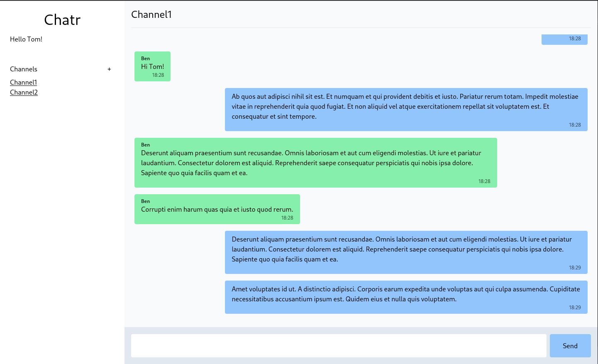

# Chatr

A simple slack-like chat using [SurrealDB](https://surrealdb.com/). Built as a proof of concept, to test out live queries. Will potentially add authentication later on.

To test yourself, run on development and open in two separate browser tabs/windows.



## Developing

Download [surrealdb cli](https://surrealdb.com/docs/installation).

Once you've created a project and installed dependencies with `npm install` (or `pnpm install` or `yarn`), start a development server:

On a separate terminal, run

```bash
surreal start memory --log trace
```

Then run

```bash
npm run dev

# or start the server and open the app in a new browser tab
npm run dev -- --open
```

## Building

This app is not optimize for build. Just a dev environment to test surrealdb.
